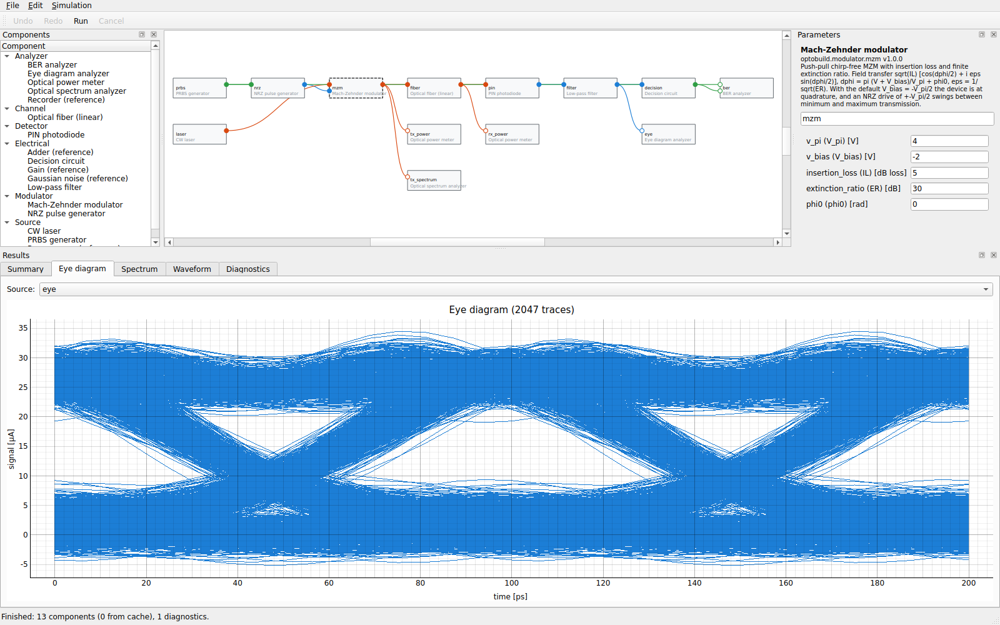

# OptoBuild

A scientifically validated optical and photonics simulation platform, built
incrementally: foundation → first validated optical link → GUI → SSFM → FSO →
coherent systems → photonic circuits → lasers → ultrafast → optimization/HPC.

**Current status: Phase 6b complete (v0.8.0)** — dual-polarization coherent
links: PBS/PBC, polarization controller, random PMD (waveplate model),
polarization-diverse receiver with hybrid imbalance and I/Q skew, and a DSP
with GSOP, deskew and a blind 2×2 CMA/RDE equalizer (`optobuild demo
dp_coherent_link`, `examples/dp_coherent_link.py`). Measured SNR matches
`2 B_ref OSNR / (2 R_s)` with random polarization, PMD, CD and LO offset;
blind DP-64QAM is a known limitation (ADR-0017). Phase 6 (v0.7.0) added single-polarization coherent
links: QPSK/16-QAM/64-QAM, RRC shaping, IQ modulator, laser phase noise,
OSNR, intradyne receiver, DSP (CD compensation, frequency-offset and timing
recovery, blind phase search), EVM/SNR/BER analysis and a constellation view
(`optobuild demo coherent_link`, `examples/coherent_link.py`). Measured SNR
matches `2 B_ref OSNR / R_s` within 0.12 dB. Phase 5 (v0.6.0) added free-space optical links:
Gaussian-beam geometry and pointing, fog/haze/rain attenuation, log-normal
and Gamma-Gamma turbulence, beam wander, outage and link budget
(`optobuild fso-budget --distance '2 km' --visibility '5 km' ...`,
`optobuild demo fso_link`, `examples/fso_link.py`). Phase 4 (v0.5.0) added nonlinear fiber propagation
(split-step Fourier NLSE with loss, β2, β3 and Kerr SPM), validated against
exact SPM, fundamental and second-order soliton solutions (`optobuild demo
soliton`, `examples/soliton.py`). Phase 3 (v0.4.0) added the GUI on top of the
validated link. Phase 2 (v0.2.0) delivered — the first validated
end-to-end optical link:

```
PRBS -> NRZ -> Mach-Zehnder modulator <- CW laser
MZM -> linear fiber -> PIN photodiode -> low-pass filter -> decision -> BER analyzer
taps: optical power meters, optical spectrum analyzer, eye diagram
```

Every model is documented with equations, SI units, assumptions and limits in
[docs/physics_models.md](docs/physics_models.md) and validated against
analytical references (CW normalization, MZM transfer, fiber attenuation,
Gaussian-pulse dispersion with the exact complex field, PIN current and noise,
filter responses, deterministic BER counting, BER of the whole link vs.
Gaussian theory, seed reproducibility).

Framework (Phase 1): immutable signals, typed component ports and parameter
schemas, registry, graph validation, deterministic topological execution with
caching/progress/cancellation, per-component seeded RNG, strict JSON/YAML
projects, CLI.

## Graphical editor (Phase 3)



```bash
pip install -e ".[gui]"             # PySide6 + pyqtgraph
optobuild gui demo:optical_link     # or: optobuild-gui path/to/project.json
```

Palette → schematic (drag from port to port to connect; incompatible ports
are rejected with an explanation) → parameter forms generated from each
component's schema with display units → run (F5) in the background → eye
diagram, spectrum, waveforms, results table and diagnostics. On headless
Linux Qt needs the EGL/GL system libraries (e.g. `libegl1 libgl1
libxkbcommon0 libfontconfig1`); tests use `QT_QPA_PLATFORM=offscreen`.

## Quick start

```bash
pip install -e ".[dev]"
optobuild components                      # list components
optobuild demo optical_link               # run the reference 10 Gb/s link
python examples/optical_link.py           # same, with a readable report + data export
optobuild run examples/optical_link.json  # run a saved project
optobuild run examples/optical_link.json --save-results out.h5   # HDF5 (needs h5py)
optobuild ber demo:optical_link --trials 20                      # Monte Carlo BER
optobuild fso-budget --distance "2 km" --visibility "5 km" --turbulence gamma_gamma --cn2 1e-14
```

Since v0.3.0: a global simulation layout (bit rate, pattern length, samples
per bit) drives all sources, results can be stored in HDF5 together with the
project that produced them, and BER can be accumulated over independent noise
trials with exact confidence intervals.

## Tests

```bash
pip install -e ".[dev]"
pytest
ruff check . && ruff format --check .
```

## Documentation

Start with [docs/architecture.md](docs/architecture.md), then
[docs/signal_model.md](docs/signal_model.md),
[docs/numerical_conventions.md](docs/numerical_conventions.md),
[docs/component_api.md](docs/component_api.md),
[docs/physics_models.md](docs/physics_models.md),
[docs/testing_strategy.md](docs/testing_strategy.md),
[docs/requirements.md](docs/requirements.md),
[docs/roadmap.md](docs/roadmap.md) and the
[architecture decision records](docs/decisions/README.md).

## License

MIT — see [LICENSE](LICENSE).
